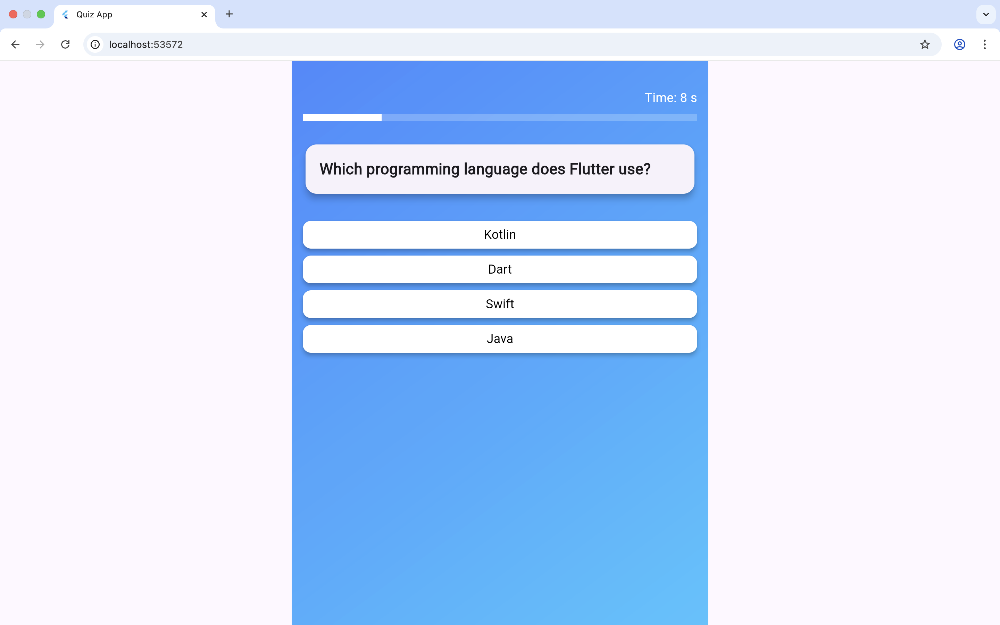
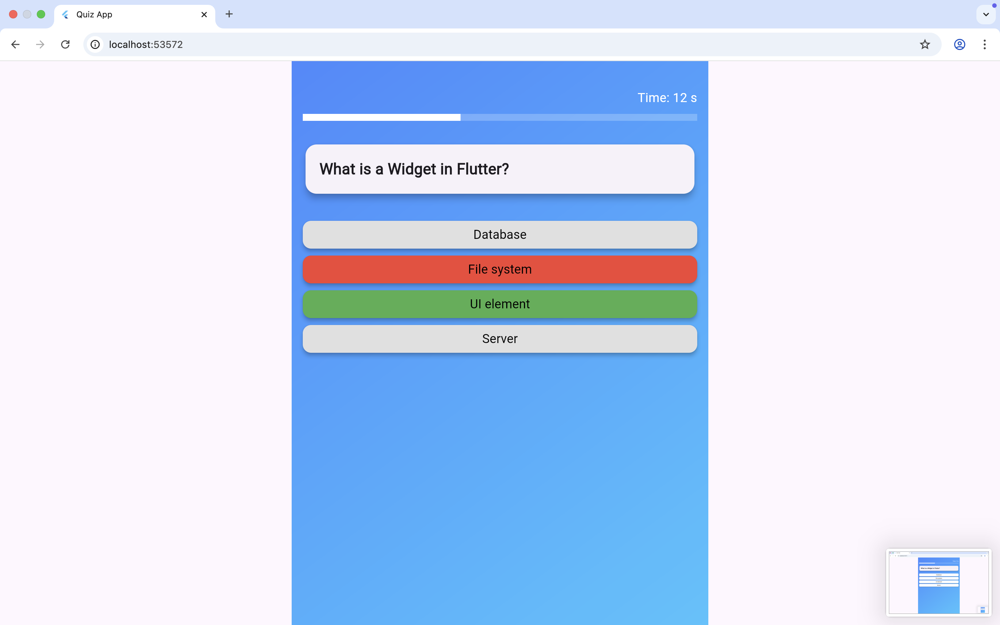
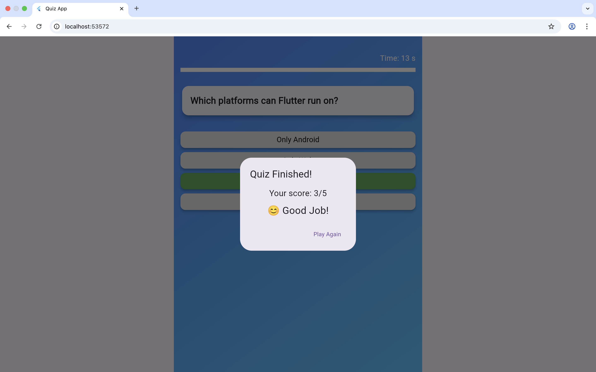

About This Project

This Quiz App is a small but interactive Flutter application I built to showcase modern UI/UX design and basic state management skills. The idea was to go beyond tutorials and create something that feels like a real, user-facing product. Users can answer multiple-choice questions, get instant feedback with colors, and see their results at the end with motivational emojis. Each attempt is different because the answer options are shuffled, making the quiz dynamic and engaging.

I designed the app with both mobile and web users in mind, focusing on a responsive layout with a gradient background, card-based questions, rounded buttons, and hover effects for web. The goal was to demonstrate how small apps can still feel polished, interactive, and professional.

Why I Built This

I wanted to explore several key aspects of building interactive apps:

Handling dynamic content and state, like timers, progress bars, and randomized options

Creating a modern and responsive UI that works on web and mobile

Practicing user experience considerations, including feedback colors, result summaries, and interaction flows

Understanding how to make a small app feel like a complete, real-world product

Even though it’s a simple quiz, I focused on clean code, reusability, and a professional look, which are essential skills for real projects.

Features

5-question multiple-choice quiz

Randomized answer order for each attempt

Countdown timer for each question

Progress bar and visual feedback for answers

End-of-quiz summary with motivational emojis

Responsive design with maximum content width for readability

Web-friendly cursor pointer and interactive buttons

Screenshots

What I Learned

How to structure a Flutter app with stateful widgets and dynamic UI

Managing timers, progress tracking, and user interactions

Implementing shuffled content to keep repeated attempts engaging

Designing a small app that feels complete and polished, even with minimal features
